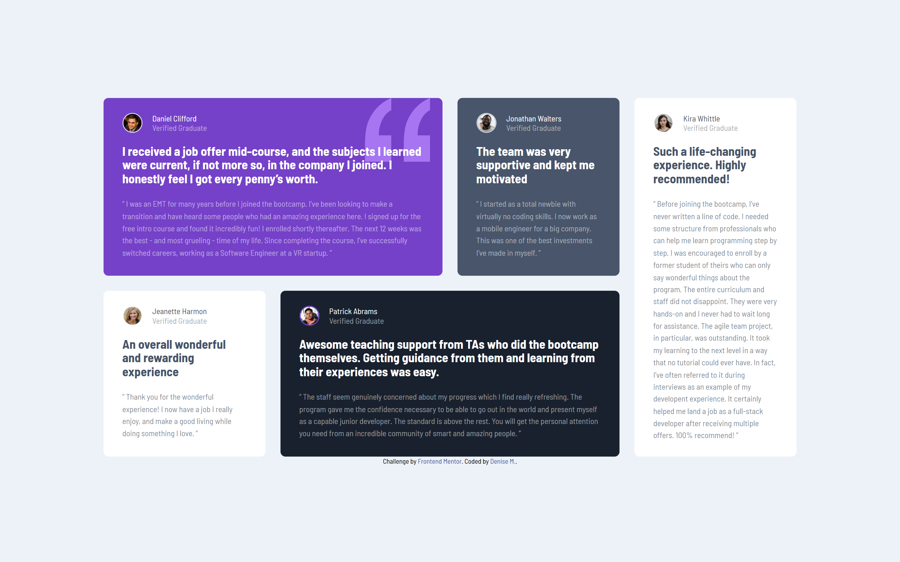

# Frontend Mentor - Testimonials grid section solution

This is a solution to the [Testimonials grid section challenge on Frontend Mentor](https://www.frontendmentor.io/challenges/testimonials-grid-section-Nnw6J7Un7). Frontend Mentor challenges help you improve your coding skills by building realistic projects.

## Table of contents

- [Overview](#overview)
  - [The challenge](#the-challenge)
  - [Screenshot](#screenshot)
  - [Links](#links)
- [My process](#my-process)
  - [Built with](#built-with)
  - [What I learned](#what-i-learned)
  - [Continued development](#continued-development)
  - [Useful resources](#useful-resources)
- [Author](#author)
- [Acknowledgments](#acknowledgments)

## Overview

### The challenge

Users should be able to:

- View the optimal layout for the site depending on their device's screen size

### Screenshot

### Links

- Solution URL: [Add solution URL here](https://your-solution-url.com)
- Live Site URL: [Add live site URL here](https://your-live-site-url.com)

## My process

### Built with

- Semantic HTML5 markup
- CSS custom properties
- Flexbox
- CSS Grid
- Mobile-first workflow

### What I learned

I've been studying the design, breaking down the layout, looking for areas that have reusable styles. Figuring out the best implementation.
As well as using a BEM class naming approach. Overall I think it helps me pinpoint small details I would've missed if i'd blindly jumped into it.
This is just part of the planning.
I'm still pretty un experienced with grid but I feel like i'm getting by just fine.

### Continued development

Future projects, I'd like to better understand the many features grid has. Bento box is pretty trendy now I wonder whats to come.
I look forward to implementing bento sections into future projects. Bigger projects I'll definetly make my life easier using libraaries and frameworks as for now i'll keep it light when possible!

### Useful resources

- [Example resource 1](https://developer.mozilla.org/en-US/docs/Web/CSS/grid-template-columns) - I'm still figuring it out!

## Author

- Frontend Mentor - [@yourusername](https://www.frontendmentor.io/profile/moncadad)

## Acknowledgments

No aknowledgements I slapped this badboy up all by meself :P
